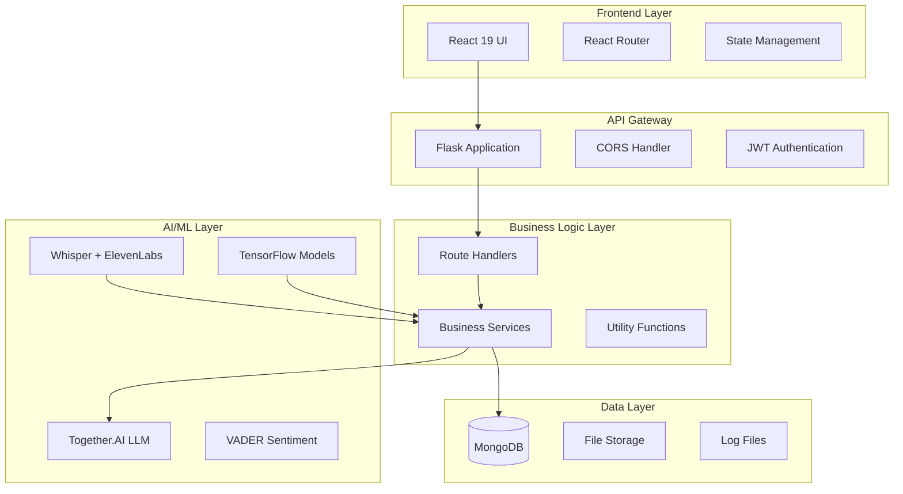
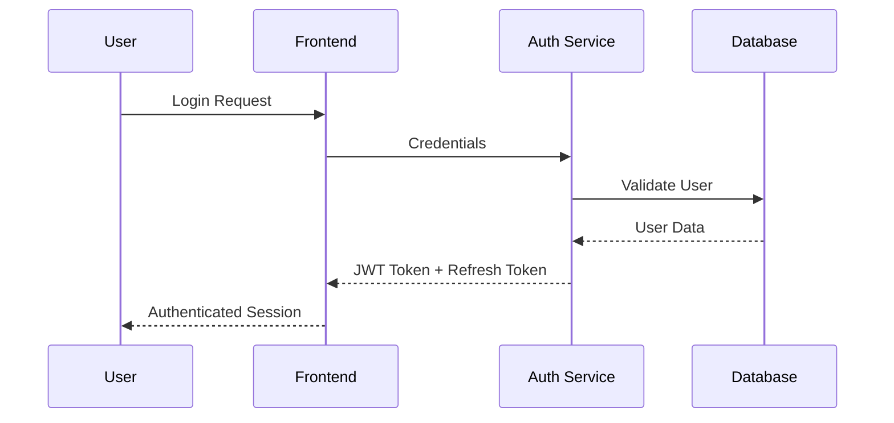
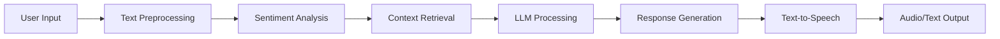

# SGP Mitra - System Architecture Documentation

## 🏗️ Overview

SGP Mitra is built on a modern, scalable microservices-inspired architecture that combines AI/ML capabilities with robust web technologies to deliver a comprehensive mental wellness platform.

## 🎯 Architecture Principles

- **Modularity**: Clear separation of concerns with distinct layers
- **Scalability**: Designed to handle growing user base and feature expansion  
- **Security**: Multi-layered security with encryption and authentication
- **Maintainability**: Clean code structure with comprehensive logging
- **Extensibility**: Plugin-ready architecture for new AI models and features

## 📊 High-Level Architecture



## 🔧 Technology Stack Deep Dive

### Backend Architecture

#### Core Framework
- **Flask 2.0+**: Lightweight WSGI web framework
- **Python 3.8+**: Core programming language
- **Gunicorn**: WSGI HTTP Server for production

#### Database Layer
```python
# MongoDB Collections Structure
{
    "users": {
        "_id": "ObjectId",
        "username": "string",
        "email": "string", 
        "password_hash": "string",
        "preferences": "object",
        "created_at": "datetime"
    },
    "chats": {
        "_id": "ObjectId",
        "user_id": "ObjectId",
        "messages": "array",
        "sentiment_scores": "array",
        "session_id": "string",
        "timestamp": "datetime"
    },
    "assessments": {
        "_id": "ObjectId", 
        "user_id": "ObjectId",
        "test_type": "string",
        "responses": "array",
        "scores": "object",
        "recommendations": "array"
    }
}
```

#### AI/ML Integration Architecture
```python
# AI Service Layer
class AIServiceManager:
    - LLM Provider: Together.AI (Exaone 3.5 32B)
    - Sentiment Analysis: VADER
    - Speech Recognition: OpenAI Whisper
    - Text-to-Speech: ElevenLabs
    - ML Models: TensorFlow/Keras
```

### Frontend Architecture

#### Component Hierarchy
```
App.jsx
├── Router Configuration
├── Authentication Context
├── Pages/
│   ├── Home.jsx (Landing)
│   ├── Auth/
│   │   ├── Login.jsx
│   │   └── Register.jsx
│   ├── Dashboard/
│   │   ├── Profile.jsx
│   │   └── Chatbotnew.jsx
│   ├── Assessment/
│   │   └── AssessmentTestPage.jsx
│   ├── Wellness/
│   │   ├── Selfcare.jsx
│   │   ├── Music_Generation.jsx
│   │   └── VoiceAssistant.jsx
│   └── Emergency/
│       └── emergency.jsx
└── Components/
    ├── UI Components
    ├── Form Components
    └── Chart Components
```

## 🔐 Security Architecture

### Authentication Flow


### Security Layers
1. **Transport Security**: HTTPS/TLS encryption
2. **Authentication**: JWT with refresh tokens
3. **Authorization**: Role-based access control
4. **Data Protection**: BCrypt password hashing
5. **Input Validation**: Sanitization and validation
6. **CORS**: Controlled cross-origin requests

## 🧠 AI/ML Architecture

### Chatbot Intelligence Pipeline


### Model Integration
- **Primary LLM**: Together.AI Exaone 3.5 32B Instruct
- **Sentiment Engine**: VADER (Valence Aware Dictionary)
- **Speech Processing**: OpenAI Whisper (base model)
- **Voice Synthesis**: ElevenLabs API
- **Assessment ML**: Custom TensorFlow models

## 📁 Directory Structure Analysis

```
SGP_Mitra-main/
├── app/                          # Backend application
│   ├── routes/                   # API endpoint definitions
│   │   ├── auth_routes.py        # Authentication endpoints
│   │   ├── chatbot_routes.py     # AI chatbot API
│   │   ├── user_routes.py        # User management
│   │   ├── test_routes.py        # Assessment endpoints
│   │   └── emergency_routes.py   # Crisis intervention
│   ├── utils/                    # Utility modules
│   │   ├── logger_utils.py       # Centralized logging
│   │   ├── security.py           # Security utilities
│   │   └── mail.py              # Email services
│   ├── data/                     # Data storage
│   │   ├── Clinical_Data/        # Assessment data
│   │   ├── model.h5             # ML model files
│   │   └── haarcascade_*.xml    # OpenCV models
│   ├── music_samples/            # Therapeutic audio
│   ├── static/                   # Static assets
│   ├── config.py                 # Configuration management
│   ├── models.py                 # Database models & AI setup
│   └── __init__.py              # Flask app factory
├── frontend/                     # React application
│   ├── src/
│   │   ├── components/           # Reusable UI components
│   │   ├── pages/               # Page components
│   │   ├── assets/              # Static assets
│   │   ├── App.jsx              # Main app component
│   │   └── index.jsx            # React entry point
│   ├── public/                   # Public assets
│   └── package.json             # Dependencies
├── logs/                         # Application logs
├── .env                         # Environment variables
├── requirements.txt             # Python dependencies
└── run.py                       # Application entry point
```

## 🔄 Data Flow Architecture

### Request Processing Flow
1. **Frontend Request**: User interaction triggers API call
2. **Authentication**: JWT token validation
3. **Route Handling**: Flask blueprint processes request
4. **Business Logic**: Service layer handles core logic
5. **AI Processing**: LLM/ML models generate responses
6. **Data Persistence**: MongoDB stores results
7. **Response**: JSON response sent to frontend
8. **UI Update**: React components re-render

### Real-time Features
- **WebSocket Support**: Flask-SocketIO for real-time chat
- **Voice Streaming**: Real-time audio processing
- **Live Sentiment**: Continuous mood tracking
- **Emergency Alerts**: Instant crisis detection

## 🚀 Deployment Architecture

### Development Environment
```bash
# Backend (Port 5000)
python run.py

# Frontend (Port 3000)  
npm start
```

### Production Considerations
- **Web Server**: Nginx reverse proxy
- **WSGI Server**: Gunicorn with multiple workers
- **Database**: MongoDB Atlas (cloud) or self-hosted
- **CDN**: Static asset delivery
- **SSL/TLS**: Certificate management
- **Monitoring**: Application performance monitoring

## 📈 Scalability Considerations

### Horizontal Scaling
- **Load Balancing**: Multiple Flask instances
- **Database Sharding**: User-based data partitioning
- **Caching Layer**: Redis for session management
- **CDN Integration**: Static asset optimization

### Performance Optimization
- **Database Indexing**: Optimized queries
- **Connection Pooling**: Efficient database connections
- **Async Processing**: Background task queues
- **Response Caching**: API response optimization

## 🔍 Monitoring & Observability

### Logging Architecture
- **Centralized Logging**: `logger_utils.py` implementation
- **Log Levels**: DEBUG, INFO, WARNING, ERROR, CRITICAL
- **Log Storage**: Timestamped files in `logs/` directory
- **Log Format**: Structured logging with context

### Health Monitoring
- **Application Health**: Endpoint monitoring
- **Database Health**: Connection status tracking
- **AI Service Health**: Model availability checks
- **Performance Metrics**: Response time tracking

## 🔧 Configuration Management

### Environment Variables
```env
# Database
MONGO_URL=mongodb://localhost:27017/sgp_mitra
MONGO_DB_NAME=sgp_mitra

# Authentication
JWT_SECRET_KEY=your_secret_key

# AI Services
TOGETHER_API_KEY=your_together_ai_key
OPENAI_API_KEY=your_openai_key
ELEVENLABS_API_KEY=your_elevenlabs_key

# Email Service
MAIL_SERVER=smtp.gmail.com
MAIL_USERNAME=your_email@gmail.com
MAIL_PASSWORD=your_app_password
```

## 🧪 Testing Architecture

### Testing Strategy
- **Unit Tests**: Individual component testing
- **Integration Tests**: API endpoint testing
- **End-to-End Tests**: Full user journey testing
- **AI Model Tests**: Response quality validation

### Quality Assurance
- **Code Linting**: ESLint (Frontend), Flake8 (Backend)
- **Type Checking**: PropTypes (React)
- **Security Scanning**: Dependency vulnerability checks
- **Performance Testing**: Load testing for scalability

---

## 📚 Additional Resources

- **API Documentation**: See `API.md`
- **Deployment Guide**: See `DEPLOYMENT.md`
- **Contributing Guidelines**: See `CONTRIBUTING.md`
- **User Manual**: See `USER_GUIDE.md`
